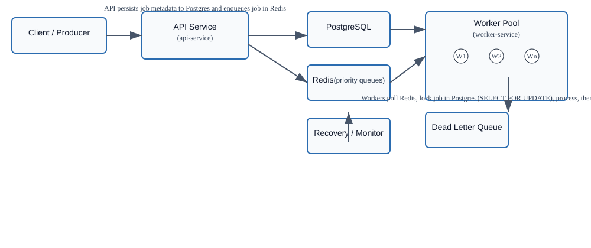

# High-Throughput Distributed Job Queue

One-line summary
A horizontally-scalable, priority-aware distributed job queue built with Java + Spring Boot that provides reliable background job processing with retries, dead-lettering, and failure recovery.

### Stack
- **Language(s):** Java 17 (primary)
- **Framework / runtime:** Spring Boot (Maven)
- **Notable libraries:** Spring Data JPA, Spring Data Redis, Lombok, H2/Postgres driver (Postgres in production)

## What this is
A fault-tolerant distributed job processing system that accepts jobs via a REST API (api-service), stores job metadata in PostgreSQL, enqueues jobs in priority Redis queues, and processes them with a pool of workers (worker-service). It provides exactly-once processing semantics via DB locking, exponential-backoff retries, and a Dead Letter Queue (DLQ) for persistent failures.

## How it's organized
Top-level tree (important entries only)
```
api-service/        # REST API to submit/manage jobs (com.pratham.apiservice)
worker-service/     # Worker runtime and recovery/retry logic (com.pratham.workerservice)
docker-compose.yml  # Local orchestration (Postgres, Redis, API, workers)
system_architecture.svg  # simplified diagram (new)
README.md
```

How it fits together
- Clients call the API (api-service) to submit jobs. The API persists job metadata to PostgreSQL and pushes the job into a Redis queue selected by priority.
- Worker instances (worker-service) poll Redis queues using a starvation-free selection strategy, claim a job, acquire a DB lock (SELECT FOR UPDATE) on the job row to ensure exclusive processing, then execute the job logic.
- On failure, workers increment retry counters and reschedule jobs using exponential-backoff; excessive failures move jobs to the DLQ. A Recovery/Monitor service periodically detects stuck jobs and re-queues them.

## Simplified architecture diagram
Use the SVG image included in the repository: `system_architecture.svg`. A Mermaid source is shown below for quick editing.



```mermaid
flowchart LR
  Client[Client / Producer] --&gt;|POST /jobs| API[API Service\n(api-service)]
  API --&gt;|persist| Postgres[(PostgreSQL)]
  API --&gt;|enqueue priority| Redis[Redis\n(priority queues)]
  subgraph Workers [Worker Pool (worker-service)]
    W1(Worker)
    W2(Worker)
    Wn(Worker)
  end
  Redis --&gt;|poll| Workers
  Workers --&gt;|SELECT FOR UPDATE| Postgres
  Workers --&gt;|on success| Postgres
  Workers --&gt;|on failure| RetryService[Retry Schedule]
  RetryService --&gt; Redis
  Workers --&gt;|exceed retries| DLQ[Dead Letter Queue]
  Monitor[Recovery Service] --&gt;|detect stuck / requeue| Redis
  Monitor --&gt;|fix inconsistent state| Postgres
```

## Screenshots

<p align="center">
  
  
</p>

## Key files & responsibilities
- api-service/src/main/java/com/pratham/apiservice/controller/JobController.java — job submission and management endpoints
- api-service/src/main/java/com/pratham/apiservice/service/QueueService.java — enqueues jobs into Redis priority queues
- api-service/src/main/java/com/pratham/apiservice/repository/JobRepository.java — JPA repository for job metadata
- worker-service/src/main/java/com/pratham/workerservice/service/WorkerService.java — worker lifecycle: poll, lock, process
- worker-service/src/main/java/com/pratham/workerservice/service/RetryService.java — schedules retries and backoff
- worker-service/src/main/java/com/pratham/workerservice/service/RecoveryService.java — detects and recovers stuck jobs
- worker-service/src/main/java/com/pratham/workerservice/service/DLQService.java — moves jobs to dead-letter store

## How to run it (quickstart)
Prereqs: Docker & Docker Compose (or Java 17 + Maven if running services locally)

Run all services with Docker Compose:
```bash
git clone https://github.com/pratham-ahuja05/distributed-job-queue.git
cd distributed-job-queue
docker-compose up --build
```

Run services individually (dev):
```bash
# API service
cd api-service
./mvnw spring-boot:run

# Worker service (in a separate shell or container)
cd worker-service
./mvnw spring-boot:run
```

Main env vars (examples; see src/main/resources/application.properties for defaults)
- SPRING_DATASOURCE_URL (jdbc:postgresql://<host>:5432/<db>)
- SPRING_DATASOURCE_USERNAME
- SPRING_DATASOURCE_PASSWORD
- SPRING_REDIS_HOST
- SPRING_REDIS_PORT
- JOB_RETRY_MAX, JOB_BACKOFF_BASE, JOB_TIMEOUT (implementation-specific names)

## Features (high level)
- Priority queues with starvation-free polling
- Exclusive job claims using DB pessimistic locking (SELECT FOR UPDATE)
- Exponential-backoff retries and DLQ for persistent failures
- Health checks and a Recovery service that re-queues stuck jobs
- Dockerized for easy local orchestration

## Roadmap / Suggested improvements
- Add metrics and tracing (Prometheus + Grafana + OpenTelemetry) — expose per-queue and per-job metrics
- Add idempotency keys at API level to avoid duplicate submissions
- Add a lightweight web UI for job inspection (list / retry / move from DLQ)
- Replace in-memory Redis queues with a persistent queue or stream (Redis Streams / Kafka) if durability under extremely high load is required
- Add automated worker scaling (Kubernetes + HPA) driven by queue length

## Troubleshooting checklist
- If jobs are not processed: confirm Redis host/port and check worker logs.
- If duplicates appear: inspect JobRepository handling and idempotency at submission.
- If jobs are stuck: check RecoveryService logs and system clocks across containers.

## Try asking
- "Where in api-service does priority selection happen? (I see QueueService.java — can we support more than 3 priorities?)"
- "How does WorkerService implement SELECT FOR UPDATE? (refer to worker-service/src/main/java/.../WorkerService.java)"
- "Can we replace system_architecture.png with the Mermaid diagram and add a small web UI mock-up for the dashboard?"
