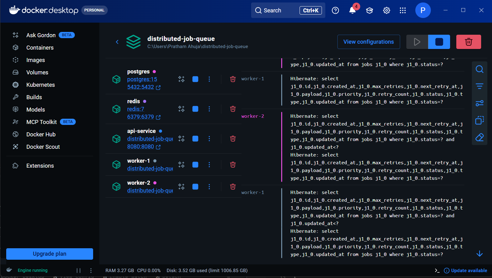
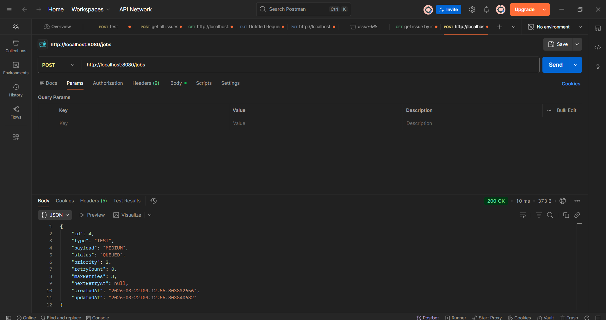

# High-Throughput Distributed Job Queue

🔥 A fault-tolerant distributed job processing system designed for high-volume asynchronous workloads with strict priority handling.

---

## 📖 Overview
This project implements a distributed background job processing system that ensures reliability under heavy load and worker failures. It solves common issues like task duplication, worker crashes, and queue starvation by combining Redis-based messaging with database-level consistency controls. Designed for scalable systems, it guarantees that high-priority jobs are processed immediately while maintaining fairness across all tasks. The architecture is ideal for use cases such as payment processing, OTP delivery, email dispatching, and other critical asynchronous workflows. The system is fully containerized, making it easy to run and test locally with production-like behavior.

---

## 📸 Screenshots

  
  

---

## ✨ Features
- multi-tier priority queue with starvation-free scheduling  
- exactly-once job execution using pessimistic locking  
- heartbeat-based failure detection and automatic recovery  
- exponential backoff retry strategy for resilient processing  
- dead letter queue (DLQ) for persistent failures  
- horizontally scalable worker architecture  
- dockerized environment for consistent deployment  

---

## 🗂️ Repository Structure
api-service/ – exposes REST endpoints to submit and manage jobs  
worker-service/ – distributed worker services that process queued jobs  
.gitignore – Git ignore rules for build and environment files  
1.png – screenshot of system UI / workflow  
2.png – additional screenshot of processing or monitoring  
README.md – project documentation  
docker-compose.yml – orchestrates all services including DB, Redis, API, and workers  

---

## 🚀 How It Works
1. A client submits a job via the API with a type, payload, and priority.  
2. The API pushes the job into a Redis queue corresponding to its priority level.  
3. Worker instances continuously poll Redis using a starvation-free strategy.  
4. A worker retrieves a job and locks its database record using `SELECT FOR UPDATE`.  
5. The job is processed and its status is updated in PostgreSQL.  
6. If processing fails, the job is retried using exponential backoff.  
7. If retries exceed limits, the job is moved to the Dead Letter Queue.  
8. A monitor service detects stuck jobs and re-queues them automatically.  

---

## 📦 Technologies Used
Java 17, Spring Boot, Spring Data JPA, PostgreSQL, Redis, Docker, Docker Compose, Maven

---

## 🔧 Configuration Options
- `priority` – defines job importance (HIGH, MEDIUM, LOW)  
- `retry.count` – number of retry attempts before failure  
- `retry.backoff` – exponential delay factor (2^n)  
- `job.timeout` – threshold to detect stuck jobs  
- `spring.datasource.*` – database connection settings  
- `spring.redis.*` – Redis connection configuration  

---

## 📊 Outputs 
- job_status table – tracks job lifecycle and processing state  
- dead_letter_queue – stores permanently failed jobs for inspection  
- application logs – provide execution trace and debugging insights  

---

## 🤝 Contributing
- add support for new job types with custom processing logic  
- extend retry strategies (e.g., jitter-based backoff)  
- implement job batching for improved throughput  
- introduce priority-based worker pools for dedicated processing  
- enhance monitoring service with configurable recovery strategies  

---

## 📝 Known Limitations
- Redis-based queues are in-memory and may require persistence tuning  
- No built-in observability (metrics/tracing) yet  
- Scaling depends on manual worker provisioning  
- Lack of request-level idempotency may allow duplicate job submissions  
- Recovery timing depends on accurate system clocks across containers  

---

## ❤️ Acknowledgements
Built using modern distributed system patterns inspired by real-world job queue architectures and Spring Boot best practices.

---

## 🔧 Things to Improve (Roadmap)
- add a web-based UI dashboard for job monitoring, retries, and system health  
- implement production-ready deployment configurations (Kubernetes, Helm charts)  
- integrate observability tools (Prometheus, Grafana, distributed tracing)  
- introduce auto-scaling for workers based on queue load  
- add authentication and rate limiting for API endpoints  
